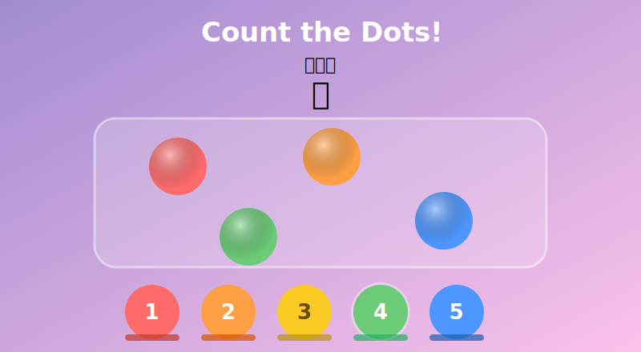

# Counting Fun

A simple browser game for toddlers learning to count. Colorful dots appear on screen and the child taps the number that matches how many they see.

## How it works

- A random number of dots pops onto the screen with a little animation
- The child picks the right number from the buttons at the bottom
- Correct answers get a celebration (wiggling dots, confetti, a cheerful sound); wrong answers get a gentle nudge to try again
- A streak counter rewards consecutive correct answers with stars

The default range is 1–5, which is appropriate for age 2–3. A small **max** selector in the bottom-left corner lets you raise it up to 20 for older kids.

## Running it

Just open `index.html` in any browser — no build step, no server, no dependencies.

Or play it live at [dsspiegel.github.io/counting-fun-cc](https://dsspiegel.github.io/counting-fun-cc/).

## Notes

Audio kicks in after the first tap (a browser requirement). Works well on tablets and touchscreens.
